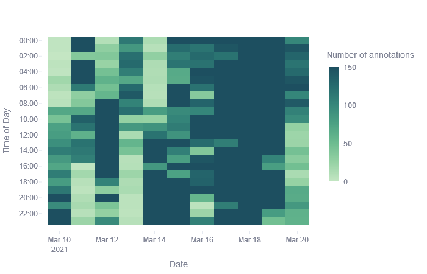
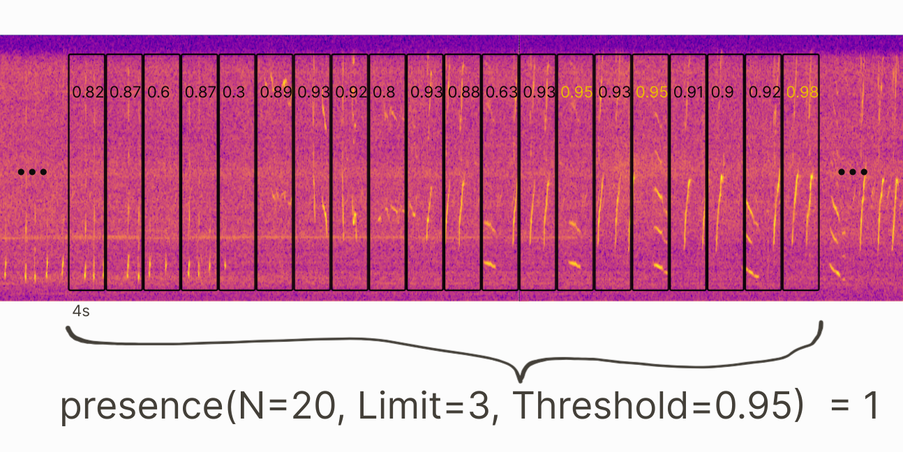
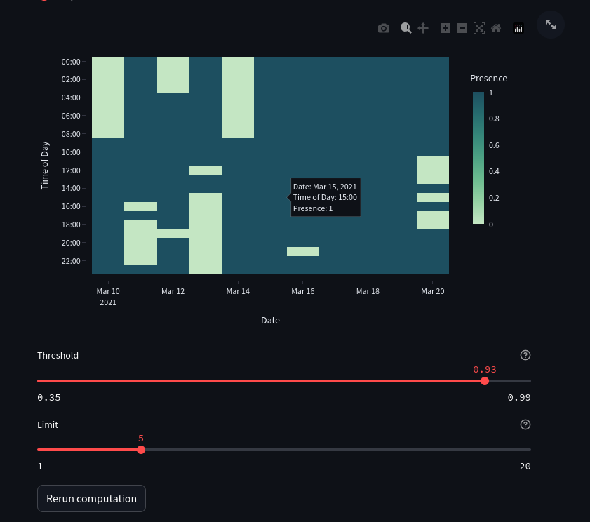

# **acodet** - **Aco**ustic **Det**ector
## Framework for the **usage** and **training** of acoustic species detectors based on CNN models

### Highlights
- **Integrated graphical user interface (GUI), so no coding required!**
- Supports Raven table format
    - resulting spreadsheets can be directly imported into raven to view annotations
- automatic generation of presence/absence visualizations
    - GUI supports interactive visualizations, allowing you to adjust model thresholds and instantly view the results
- headless version included for those that prefer command line tools
- interactive post-processing methods to reduce false-positives
---------------------------------------------------
sample output:



Play around with the GUI in the __Online Demo__ here:
https://acodet-web.streamlit.app/
(the program will look identical when executed on your computer)

__Video tutorials__ for installation and usage of the AcoDet GUI:
https://www.youtube.com/watch?v=bJf4d8qf9h0&list=PLQOW4PvEYW-GNWIYRehs2-4-sa9T20c8A

The corresponding paper to acodet can be found here: 
https://doi.org/10.1121/10.0025275


## Table of Contents
- [Installation](#installation)
    - [Installation on Windows](#installation-on-windows)
    - [Installation on Mac](#installation-on-mac)
    - [Installation on Linux](#installation-on-linux)
- [Usage](#usage)
    - [acodet Usage with GUI](#acodet-usage-with-gui)
        - [Usecase 1: Generating annotations (GUI)](#usecase-1-generating-annotations-gui)
        - [Usecase 2: Generating new training data (GUI)](#usecase-2-generating-new-training-data-gui)
        - [Usecase 3: Training (GUI)](#usecase-3-training-gui)
    - [acodet Usage headless](#acodet-usage-headless)
        - [Usecase 1: Generating annotations](#usecase-1-generating-annotations)
        - [Usecase 2: Generating new training data](#usecase-2-generating-new-training-data)
        - [Usecase 3: Training](#usecase-3-training)
- [Explanation of Sequence limit](#explanation-of-sequence-limit)
- [Citation](#citation)
- [FAQ](#faq)


----------------------------------------------------
# Installation
## Installation on Windows
### Preliminary software installations:
- install python 3.8: (standard install, no admin privileges needed)
<https://www.python.org/ftp/python/3.8.0/python-3.8.0-amd64.exe>
- install git bash: (default install)
<https://github.com/git-for-windows/git/releases/download/v2.38.1.windows.1/Git-2.38.1-64-bit.exe>

### Installation instructions
- create project directory in location of your choice
- open git bash in project directory (right click, Git Bash here)
- clone the repository:

`git clone https://github.com/vskode/acodet.git`
- Install virtualenv (copy and paste in Git Bash console):

`"$HOME/AppData/Local/Programs/Python/Python38/python" -m pip install virtualenv`

- Create a new virtual environment (default name env_acodet can be changed):

 `"$HOME/AppData/Local/Programs/Python/Python38/python" -m virtualenv env_acodet`

- activate newly created virtual environment (change env_acodet if necessary):

`source env_acodet/Scripts/activate`

- Install required packages:

`pip install -r acodet/requirements.txt`

-------------------------

## Installation on Mac
### Preliminary software installations:
- install python 3.8: (standard install, no admin privileges needed)
<https://www.python.org/ftp/python/3.8.7/python-3.8.7-macosx10.9.pkg>
- install git: (default install)
    - simply type `git` into the terminal and follow the installation instructions

### Installation instructions
- create project directory in location of your choice
- open a terminal in the project directory
- clone the repository:

    `git clone https://github.com/vskode/acodet.git`
- Install virtualenv (copy and paste in Git Bash console):

    `/usr/bin/python/Python38/python -m pip install virtualenv`

- Create a new virtual environment (default name env_acodet can be changed):

    `/usr/bin/python/Python38/python -m virtualenv env_acodet`

- activate newly created virtual environment (change env_acodet if necessary):

    `source env_acodet/bin/activate`

- Install required packages:
    - if you have a M1 chip in your mac, run:

        `pip install -r acodet/macM1_requirements/requirements_m1-1.txt`
    - then run 

        `pip install -r acodet/macM1_requirements/requirements_m1-1.txt`
    
    - if you have an older mac, run:

        `pip install -r acodet/requirements.txt`

--------------------------------------------
## Installation on Linux
### Preliminary software installations:
- install python 3.8: (standard install, no admin privileges needed)
<https://www.python.org/ftp/python/3.8.0/python-3.8.0-amd64.exe>
- install git bash: (default install)
<https://github.com/git-for-windows/git/releases/download/v2.38.1.windows.1/Git-2.38.1-64-bit.exe>

### Installation instructions
- create project directory in location of your choice
- open a terminal in the project directory
- clone the repository:

    `git clone https://github.com/vskode/acodet.git`
- Install virtualenv (copy and paste in Git Bash console):

    `/usr/bin/python/Python38/python -m pip install virtualenv`

- Create a new virtual environment (default name env_acodet can be changed):

    `/usr/bin/python/Python38/python -m virtualenv env_acodet`

- activate newly created virtual environment (change env_acodet if necessary):

    `source env_acodet/bin/activate`

- Install required packages:

    `pip install -r acodet/requirements.txt`

# Usage
## AcoDet usage with GUI

AcoDet provides a graphical user interface (GUI) for users to intuitively use the program. All inputs and outputs are handled through the GUI. To run the gui, run (while in acodet directory):

`streamlit run streamlit_app.py`

This should start a new tab in a web browser which runs the interface that you can interact with. It is important that your virtual environment where you have installed the required packages is active, for that see the Installation sections. To activate the environment run 

`source ../env_acodet/Scripts/activate` (on Windows) 
or 

`source ../env_acodet/bin/activate` (on Mac/Linux) 

while your terminal directory is inside **acodet**. 

### Usecase 1: generating annotations (GUI)

- Choose the 1 - Inference option from the first drop-down menu
- Choose between the predefined Settings
0. run all of the steps
1. generating new annotations 
2. filterin existing annotations
3. generating hourly predictions
- click Next
- Depending on your choice you will be prompted to enter the path leading to either your sound files our existing annotation files 
    - Enter a path in the text field that is one directory above the folder you would like to use
    - In the dropdown menu you will be presented with all the folders inside the specified path. Choose the one you would like to work with
    - **Important**: time stamps are required within the file names of the source files for steps 0. and 3.
- If required, choose a Model threshold
- click Run computation
- A progress bar should show the progress of your computations
- click Show results
- The Output section will provide you with information of the location of the files, and depending on your choice of predifines Settings will show different tabs.
    - the "Stats" is an overview of all processed files, with timestamp and number of predictions
    - the "Annot. Files" gives you a dropdown menu where you can look into prediction values for each vocalization within each source file. By default the threshold for this will be at 0.5, meaning that all sections with prediction values below that will be discarded.
    - the "Filtered Files" shows the same as the previous tab, however, it only shows sections with previously defined values exceeding the predefined threshold.
    - the "Annotaion Plots" shows you a visualization revealing the number of anotations per hour in your dataset. Choose your dataset from the dropdown (in some cases there is only one dataset inside your previously defined folder). 
        - The calculations behind this visualization is explained in detail in the corresponding journal paper that is currenlty under review and will be linked here as soon as published.
        - You can choose between a "Simple limit" and a "Sequence limit" 
            - the main distinction is whether consecute vocalizations are required for them to be counted (this should help reduce false positives)
            - the "Simple limit" will compute much faster than the "Sequence limit"
        - You can also change the threshold of the model predictions which will then allo you to update the visualization. If the "Sequence limit" is chose, the number limit can also be changed, which will change the required number of consecutive vocalizations for them to be counted. (Try it out)
        - All visualizations can be exported as .png files by clicking on the small camera icon in the top right.
    - the "Presence Plots" shows a similar visualization as the previous section, however, only showing binary presence.


### Usecase 2: generating new training data (GUI)

This feature is currently not integrated in the gui.
### Usecase 3: training (GUI)

This feature is currently not integrated in the gui.

## AcoDet usage headless
Users only need to change the files **simple_congif.yml** and **advanced_config.yml** to use AcoDet. Once the config files are changed, users can run the program by running the command `python run.py` inside the **acodet** directory.

### Usecase 1: generating annotations
To generate annotations:
- open the file **simple_config.yml** in any Editor (default is Notepad). 
- change `run_config` to `1`
- change `predefined_settings` to one of the following:
    - `1` for generating annotations with a threshold of 0.5
    - `2` for generating annotations with a custom threshold
        - specify threshold (**thresh**) value in **simple_config.yml** (defaults to 0.9)
    - `3` for generating hourly counts and presence spreadsheets and visualizations (using the sequence criterion and the simple limit)
        - _simple limit_ and _sequence criterion_ are accumulation metrics aiming to deliver hourly presence information, while filtering out false positives
            - _simple limit_ -> only consider annotations if the number of annotations exceeding the **thresh** value is higher than the value for **simple_limit** in **simple_config.yml** (in a given hour in the dataset)
            - _sequence criterion_ -> only consider annotations if the number of consecutive annotations within **sc_con_win** number of windows exceeding the **sc_thresh** value is higher than **sc_limit** (in a given hour in the dataset)
        - hourly counts gives the number of annotations according to the accumulation metrics
        - hourly presence gives a binary (0 -> no whale; 1 -> whale) corresponding to whether the accumulation metrics are satisfied
    - `4` for generating hourly counts and presence spreadsheets and visualizations (using only the simple limit)
    - or `0` to run all of the above in sequece
- change `sound_files_source` to the top level directory containing the dataset(s) you want to annotate

- once finished, save the **simple_config.yml** file

To start the program:
- activate the virtual environment again:

`source env_acodet/Scripts/activate`

- run the run.py script:

`python acodet/run.py`

### Output

The software will now run thorugh your dataset and gerate annotations for every (readable) soundifle within the dataset. While running, a spreadsheet, called stats.csv is continuously updated showing information on the annotations for every file (do not open while program is still running, because the program wont be able to access it).

The program will create a directory called `generated_annotatoins` in the project directory. It will then create a directory corresponding to the date and time that you started the annotation process. Within that directory you will find a directory `thresh_0.5` corresponding to all annotations with a threshold of 0.5. Furthermore you will find the `stats.csv` spreadsheet.

If you have chosen option 2 (or 0) you will also find a directory `thresh_0.x` where the x stands for the custom threshold you specified in the **simple_config.yml** file. Within the `thresh` directories you will find the name of your dataset. 

If you have chosen option 3, 4 or 0 you will find a directory `analysis` within the dataset directory. In that directory you will find spreadsheets for hourly presence and hourly counts, as well as visualizations of the hourly presence and hourly counts.

### Usecase 2: generating new training data

Either use manually created annotations -> option 2, or create new annotations by reviewing the automatically generated annotations -> option 1.

For option 1, use Raven to open sound files alongside their automatically generated annotations. Edit the column `Predictions/Comments` by writing `n` for noise, `c` for call, or `u` for undefined. If the majority of the shown windows are calls, add the suffix `_allcalls` before the `.txt` ending so that the program will automatically label all of the windows as calls, unless specified as `n`, `c`, or `u`. The suffix `_allnoise` will do the same for noise. The suffix `_annotated` will label all unchanged windows as undefined - thereby essentially ignoring them for the created dataset.

Once finished, insert the top-level directory path to the `reviewed_annotation_source` variable in **simple_config.yml**. 

To generate new training data:
- open the file **simple_config.yml** in any Editor (default is Notepad). 
- change `run_config` to `2`
- change `predefined_settings` to one of the following:
    - `1` for generating training data from reviewed annotations
    - `2` for generating training data from manually created training data (space in between annotations will be interpretted as noise)
- change `sound_files_source` to the top level directory containing the dataset(s) containing the sound files

- once finished, save the **simple_config.yml** file

To start the program:
- activate the virtual environment again:

`source env_acodet/Scripts/activate`

- run the run.py script:

`python acodet/run.py`

### Usecase 3: training

To train the model:
- open the file **simple_config.yml** in any Editor (default is Notepad). 
- change `run_config` to `3`
- change `predefined_settings` to one of the following:
    - `1` for generating training data from reviewed annotations

- once finished, save the **simple_config.yml** file
- more adcanced changes for model parameters can be done in **advanced_config.yml**

To start the program:
- activate the virtual environment again:

`source env_acodet/Scripts/activate`

- run the run.py script:

`python acodet/run.py`

# Explanation of Sequence limit
Besides a simple thresholding (simple limit) the sequence limit can be used to distinguish repeating vocalizations from other noise sources. For humpback whales this vastly reduces the number of generated false positives.

To briefly explain:
In a stream of 20 consecutive windows (of approx. 4 s length) you can set limit and threshold. After applying the limit, predictions are only kept if they exceed the threshold and occur in thre frequency set by the limit. This is especially convenient for __hourly presence__ annotations. The below image shows an example of 20 consecutive windows with their given model prediction values. The highlighted values exceed the threshold and since they occur in the required frequency (Limit=3), the hourly presence yield the value 1.



The sequence limit can be useful in noisy environments, where vocalizations are masked by noise and their repetitiveness can be used to distinguish them from irregular background noise.

Threshold and limit can be set interactively and their effect on the data can be analyzed right away. As this is only post-processing the existing annotations, computing time is very fast. The following image shows a screenshot of the sequence limit in the acodet GUI.



# Citation

If you used acodet in your work, please reference the following:

Vincent Kather, Fabian Seipel, Benoit Berges, Genevieve Davis, Catherine Gibson, Matt Harvey, Lea-Anne Henry, Andrew Stevenson, Denise Risch; Development of a machine learning detector for North Atlantic humpback whale song. J. Acoust. Soc. Am. 1 March 2024; 155 (3): 2050–2064.

For bibtex:
```bibtex
@article{10.1121/10.0025275,
    author = {Kather, Vincent and Seipel, Fabian and Berges, Benoit and Davis, Genevieve and Gibson, Catherine and Harvey, Matt and Henry, Lea-Anne and Stevenson, Andrew and Risch, Denise},
    title = "{Development of a machine learning detector for North Atlantic humpback whale song}",
    journal = {The Journal of the Acoustical Society of America},
    volume = {155},
    number = {3},
    pages = {2050-2064},
    year = {2024},
    month = {03},
    issn = {0001-4966},
    doi = {10.1121/10.0025275}
}
```

# FAQ

At the moment the generation of new training data and the training are not yet supported in the graphical user interface.
